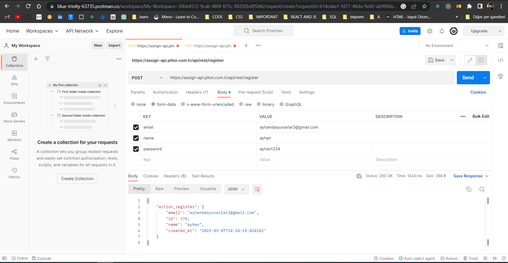
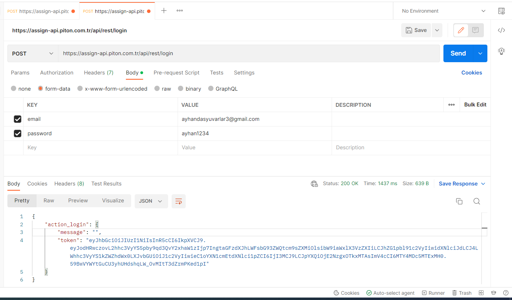
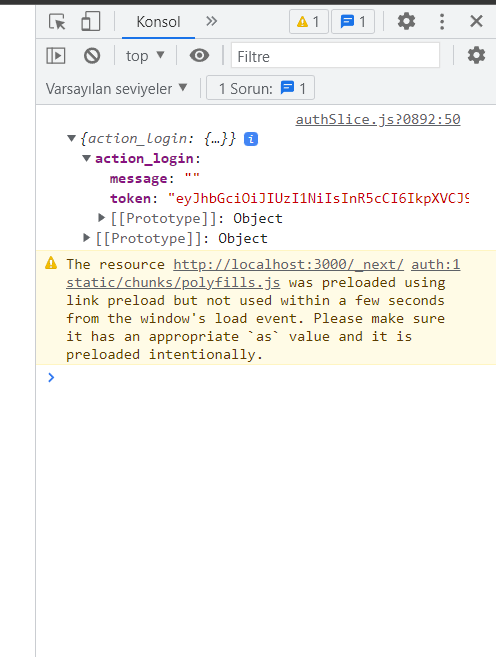

# Piton-Assignment

### İlk önce projeyi inceledim figmadan tasarım bakış acısında bulundum, ve bana gerekli olan kütüphaneleri not aldım ve araştırdım , nextjs başlıyalım yaklaşık 3 hafta filan oldu ve tamamıyla hakim değildim , sonra gerekli araştırmalarımı yaparak bana gerekli materyalleri bitirdim ve projeye başladım .

# projeyi başlatma

```jsx
 npx create-next-app@latest
```

## ve bu işlemden sonra gerekli olan kütüphaneleri indirmeye geldi sıra

```jsx
npm i @reduxjs/toolkit react-redux formik yup react-icons tailwindcss ...
```

### İndirmiş olduğum bu kütüphaneleri anlatamak gerekirse

- redux : state management
- formik , yup : form control
- react-icons : iconlar
- tailwindcss : style

### Projemde ilk gereksiz dosyaları temizledim sonra hiyerarşik yapıyı kurgulamaya başladım , öncelikle giriş yapma ve kayıt olma sayfaları yaptım sonrasında ise redux yapısını kurguladım ve kategorileri ve onlara ait ürünleri çektim. Tabi bu biraz sıkıntıylı çünkü ürünleri listeleyemedim bunun için alternatif çözümler ürettim ve ilk fetch işlemini yaptıkdan sonra category datasında gelen category.idleri aldim ve her bir ürüne categoryId ekledim . sonrasinda ise <code>filter()</code> array fonksiyonu kullanarak eşleştirme yaptım ve veriyi düzenli ve güzel bir şekilde elde ettim .

```jsx
export const fetchProducts = createAsyncThunk(
  "products/getProducts",
  async (id) => {
    const response = await fetch(
      `https://assign-api.piton.com.tr/api/rest/products/${id}`
    );

    const { product } = await response.json();
    const loadedProducts = product.map((item) => {
      // burada gelen ürünlere category id ekliyorum
      item.categoryId = id;
      return item;
    });
    return loadedProducts;
  }
);
```

```jsx
"use client";
import { fetchProducts, selectProducts } from "@/reducer/productsSlice";
import React, { useEffect } from "react";
import { useDispatch, useSelector } from "react-redux";

const ProductList = ({ id }) => {
  const { products } = useSelector(selectProducts);
  const dispatch = useDispatch();
  useEffect(() => {
    dispatch(fetchProducts(id));
  }, [dispatch]);

  const filter = products.filter((item) => item.categoryId === id);

  let uniqueIds = {};
  // burada aynı idlere sahip itemleri silme işlemi yapıyoruz
  let uniqueData = filter.filter(function (item) {
    return uniqueIds.hasOwnProperty(item.id)
      ? false
      : (uniqueIds[item.id] = true);
  });

  return (
    <div>
      {uniqueData.map((item) => (
        <div key={item.id}>{item.name}</div>
      ))}
    </div>
  );
};

export default ProductList;
```





### Projeyi bitirdim gerekli kontrolleri postman ile yaptım nextjs ile yaklaşık 3 hafta öğrenmeye başladım , tamamını bilmiyorum aynı şekilde tailwindcss ile de aynı şekilde , projemi inceledeğiniz için teşekkür ederim
